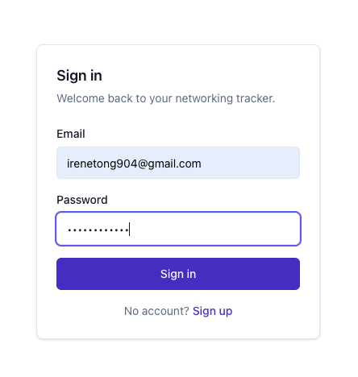
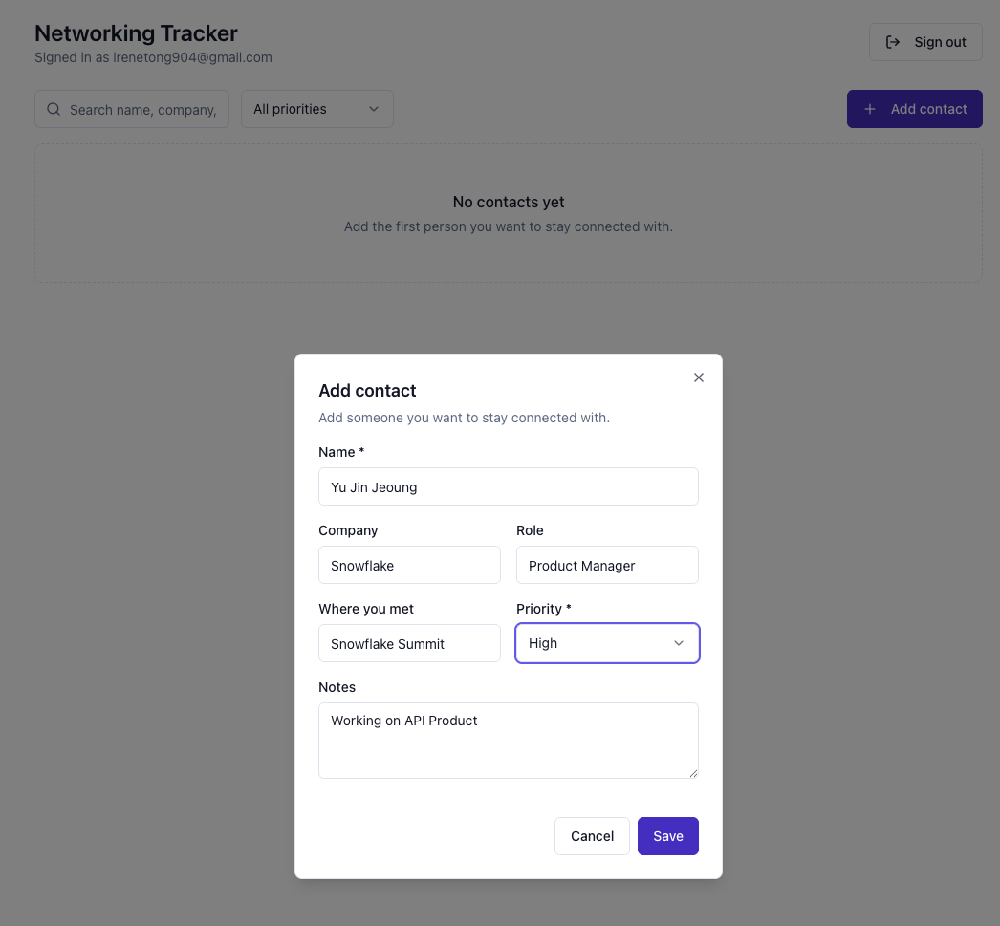
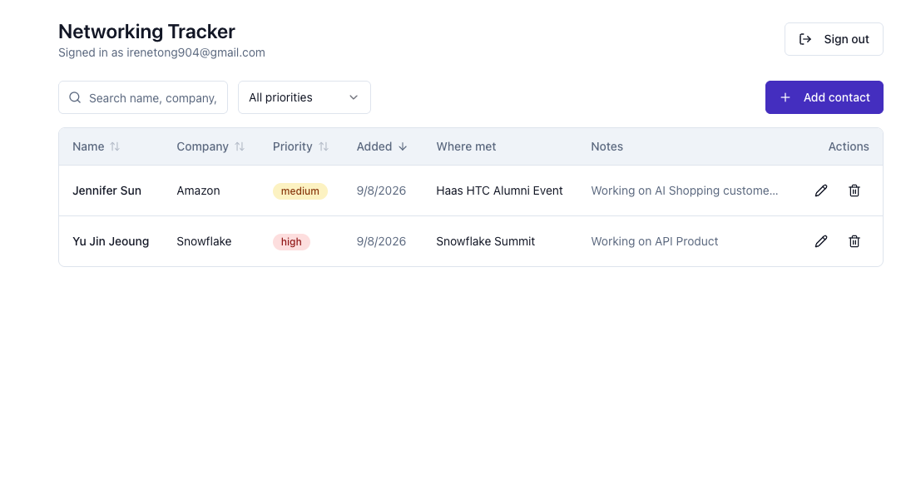

# Networking Tracker

A private, secure contact list for the people you want to stay connected with at Berkeley — add
someone once (name, company, role, where you met, notes, priority), then sort, filter, edit, or
delete them any time. Every contact belongs to exactly one signed-in user; nobody else can see or
touch it, enforced by Postgres Row Level Security rather than just app-layer code.

**Live app:** https://networking-tracker-ten-wine.vercel.app

## Screenshots / walkthrough

Sign in:



Adding a contact:



The resulting contacts table, sortable by column, with priority badges:



Every functional and security requirement — including sign-out, edit, delete + refresh
persistence, two-account isolation, and invalid-input rejection — has been manually verified
end-to-end directly against the live production URL; see the [Verification
checklist](#verification-checklist) and the detailed request/response logs below for the ones not
pictured above.

### Verified manually against a live Neon project (2026-09-03)

- **Sign-up / sign-in / sign-out**: created `usera-test@example.com`, session persisted across
  navigation, sign-out cleared it and redirected to `/sign-in`.
- **Invalid name**: submitting a whitespace-only name rendered "Name is required." inline and made
  no request that touched the database.
- **Create / edit / delete / refresh**: added a contact, edited its notes, confirmed the change
  survived a full page reload, then deleted it and confirmed it was gone after reload.
- **Sort**: clicking a column header re-sorted the list (verified via network requests, e.g.
  `GET /api/contacts?sort=priority&order=asc`).
- **Two-account isolation**: signed in as a second user, `userb-test@example.com`, and confirmed
  the contacts list was empty (User A's contact never appeared). Then, using User B's own valid
  session token, sent direct `PATCH` and `DELETE` requests to User A's contact id straight at the
  backend (bypassing the UI entirely):
  ```
  PATCH /api/contacts/<user-a-contact-id>  → 404 {"error":"Contact not found."}
  DELETE /api/contacts/<user-a-contact-id> → 404 {"error":"Contact not found."}
  ```
  A direct database check (bypassing RLS, as the table owner) confirmed User A's row was completely
  unchanged afterward — RLS silently excluded it from User B's query rather than letting the write
  touch it. This surfaced a real bug, since fixed: the backend originally read a 200 with an empty
  result as success, when it actually meant "RLS matched zero rows." `backend/src/routes/contacts.ts`
  now treats an empty array from update/delete the same as an error and returns 404.

### Re-verified against the live production URL (2026-09-08)

Everything above was re-run against `https://networking-tracker-ten-wine.vercel.app` itself, not
just local dev: signed in/out as `usera-test@example.com` and `userb-test@example.com`, created a
contact, deleted it, confirmed it stayed gone after a refresh, and submitted a whitespace-only name
(rejected inline). For the isolation test specifically, signed in as User B and, using **User B's
own production session token**, sent direct requests to the live API at two other users' contact
ids:

```
GET   /api/contacts                        → 200, 0 rows (neither other user's contact listed)
PATCH /api/contacts/<user-a-contact-id>     → 404 {"error":"Contact not found."}
DELETE /api/contacts/<user-a-contact-id>    → 404 {"error":"Contact not found."}
PATCH /api/contacts/<other-user-contact-id> → 404 {"error":"Contact not found."}
DELETE /api/contacts/<other-user-contact-id>→ 404 {"error":"Contact not found."}
```

A direct query against the production database immediately afterward confirmed both other users'
rows were byte-for-byte unchanged.

**Ownership-reassignment attempt (`WITH CHECK` specifically):** the tests above show one user can't
touch *another* user's row. The separate, more subtle guarantee is that a user can't take a row they
*do* own and hand it to someone else. Signed in as User A, called the Neon Data API **directly**
(bypassing this project's own Express backend entirely) with User A's own token, targeting User A's
own contact, attempting to overwrite its `user_id` to another real user's id:

```
PATCH https://<data-api-host>/contacts?id=eq.<user-a-contact-id>
Authorization: Bearer <user-a-token>
Body: {"user_id": "<a-different-real-user-id>"}

→ 403 {"code":"42501","message":"new row violates row-level security policy for table \"contacts\""}
```

That's Postgres itself rejecting the write — not this app's code — because the resulting row would
fail `contacts_update`'s `WITH CHECK (auth.user_id() = user_id)`. A follow-up query confirmed the
row's `user_id` was untouched.

## Features

- Email/password sign up, sign in, and sign out via Neon Managed Better Auth
- Add a contact with name, company, role, where you met them, notes, and priority
- Priority is restricted to `high` / `medium` / `low` — enforced in the backend and in the database
- Sortable, filterable contact table (search by name/company/role, filter by priority, sort by any
  column, ascending or descending)
- Edit and delete your own contacts; contacts persist across refresh (Neon Postgres)
- Clear loading, empty, success, and error states throughout
- Responsive layout: a table on wider screens, a stacked card list on phones

## Technology stack and why

| Layer | Choice | Why |
| --- | --- | --- |
| Frontend | React 19 + Vite + TypeScript | A plain React SPA, as required — Vite gives fast local dev and a small static build with no framework-specific server runtime to reason about |
| Component/design system | Tailwind CSS v4 + Radix UI primitives (shadcn/ui-style components) | Accessible, unstyled primitives (`Dialog`, `Select`, `Label`) wrapped in a small local `components/ui` library, styled with Tailwind utility classes and CSS variables for light/dark theming |
| Backend | Node.js + Express + TypeScript | A real, separate server process (not framework-integrated API routes) that owns request validation, matching the assignment's "frontend and backend separated" requirement literally |
| Validation | Zod | Precise, typed schema with human-readable error messages, shared between the create and edit code paths |
| Database | Neon Postgres | Managed serverless Postgres; branchable, cheap, and pairs natively with Neon Auth/Data API |
| Auth | Neon Managed Better Auth | Hosted email/password auth that issues JWTs Postgres can verify directly via `auth.user_id()` — no session-store code to write |
| Data access | Neon Data API (`@neondatabase/neon-js`) | A PostgREST-compatible REST layer in front of Postgres; the frontend reads through it directly (RLS-protected), the backend writes through it after validating |
| Testing | Vitest + Supertest | Fast, native ESM/TypeScript test runner; Supertest drives the Express app in-process with no real network calls |
| Hosting | Vercel | One `vercel.json` multi-build config deploys the static frontend and the Express backend (as a serverless function) from a single repo to a single URL |

## Architecture

```
Browser (frontend/, React SPA)
  │
  ├─ Auth: neon-js browser client ──────────────► NEXT_PUBLIC_NEON_AUTH_URL
  │        sign up / sign in / sign out / session      (Neon Managed Better Auth)
  │
  ├─ Reads: neon-js browser client ─────────────► NEXT_PUBLIC_NEON_DATA_API_URL
  │        list / sort / filter contacts               (Neon Data API, RLS-scoped)
  │
  └─ Writes: fetch, Authorization: Bearer <jwt> ─► backend/ (Express, /api/contacts...)
                                                          │
                                                          │ Zod-validates the body,
                                                          │ then forwards the same JWT
                                                          ▼
                                                   Neon Data API ──► Postgres (RLS-enforced)
```

**Frontend (`frontend/`)** is a Vite/React single-page app. It talks to Neon in two ways:
authentication (sign up, sign in, sign out, session check) goes straight to Neon's Auth service,
and *reads* of the contact list go straight to the Data API — both are safe to expose to the
browser because Postgres Row Level Security (RLS), not the frontend, is what actually restricts
which rows come back. *Writes* (create/edit/delete) are routed through the backend instead, so
there is one real, trusted place validation happens.

**Backend (`backend/`)** is a standalone Express app (own `package.json`, own TypeScript project).
Every request must carry the caller's own `Authorization: Bearer <jwt>` (the same token Better
Auth issued the browser); the backend never uses a service-level credential. It validates the
request body with Zod, then forwards that exact token to the Data API — RLS in Postgres re-checks
ownership on every query regardless of what the backend does or doesn't catch.

**Database**: one `contacts` table in Neon Postgres. See [Database schema](#database-schema) below.

**Hosting**: a single Vercel project. `vercel.json` builds `frontend/` as a static site and
`backend/api/index.ts` (which exports the Express app) as a Node serverless function, and routes
`/api/*` to the function, `/assets/*` (and the two root SVGs) straight to the static build's files,
and everything else to `frontend/index.html` for client-side routing — one live URL for both
halves. One non-obvious detail: `@vercel/static-build`'s output for a build rooted at
`frontend/package.json` lands at `frontend/*` in the deployment, not `frontend/dist/*` — the
`distDir` config flattens away, it doesn't nest under it.

## Local setup

Prerequisites: Node 20+, a Neon account, and the Neon project set up per
[Neon project setup](#neon-project-setup) below.

```bash
git clone <your-repo-url>
cd networking-tracker
cp .env.example frontend/.env.local
cp .env.example backend/.env.local
```

Edit both `.env.local` files and fill in the real values from your Neon project (see next
section). `frontend/.env.local` only needs `NEXT_PUBLIC_NEON_AUTH_URL`,
`NEXT_PUBLIC_NEON_DATA_API_URL`, and `VITE_API_BASE_URL=http://localhost:8787`.
`backend/.env.local` needs `NEXT_PUBLIC_NEON_DATA_API_URL` (to reach the Data API) and,
optionally, `DATABASE_URL` (only used one-off, to run the schema below) and
`FRONTEND_ORIGIN=http://localhost:5173`.

```bash
# terminal 1 — backend
cd backend
npm install
npm run dev        # http://localhost:8787

# terminal 2 — frontend
cd frontend
npm install
npm run dev         # http://localhost:5173
```

Open `http://localhost:5173`, sign up, and start adding contacts.

## Neon project setup

I can't create a Neon account or project on your behalf — do this once, yourself. Either path
below gets you the same two URLs and a `DATABASE_URL`.

**Option A — Neon console:**

1. Create a Neon project (free tier is enough).
2. Go to **your database → Data API**, check **Use Managed Better Auth**, optionally check
   **Grant public schema access**, and click **Enable Data API**.
3. Copy the **Auth URL** and **Data API URL** shown there into your two `.env.local` files as
   `NEXT_PUBLIC_NEON_AUTH_URL` / `NEXT_PUBLIC_NEON_DATA_API_URL`.

**Option B — Neon CLI** (what this project was actually set up with):

```bash
npm i -g neon@latest
neon login                                        # opens a browser to authenticate
neon link --project-id <your-project-id> --branch production
neon config init                                  # scaffolds neon.ts
```

Edit the generated `neon.ts` to `defineConfig({ auth: true, dataApi: true })`, then:

```bash
neon deploy   # provisions Neon Auth + the Data API, writes .env.local at the repo root
```

This writes `DATABASE_URL`, `NEON_AUTH_BASE_URL`, and `NEON_DATA_API_URL` — map the latter two into
`frontend/.env.local` / `backend/.env.local` as `NEXT_PUBLIC_NEON_AUTH_URL` /
`NEXT_PUBLIC_NEON_DATA_API_URL` (this repo's code uses the `NEXT_PUBLIC_` names the assignment
specifies; the CLI's own names differ).

**Either way, finish with:**

4. Run [`db/schema.sql`](db/schema.sql) against `DATABASE_URL` (Neon's SQL editor, or
   `psql "$DATABASE_URL" -f db/schema.sql`, or any Postgres client) — it creates the `contacts`
   table, its `CHECK` constraints, all four RLS policies, **and the `GRANT`s that make them take
   effect**. That last part matters: RLS only narrows which rows a query can touch — Postgres still
   checks table-level `GRANT`s first, and without `grant select, insert, update, delete on
   contacts to authenticated`, every request fails with `permission denied for table contacts`
   before RLS is ever evaluated. The Neon console's "Grant public schema access" checkbox does this
   for you; the CLI/`neon.ts` path does not, so `db/schema.sql` includes it explicitly — this is
   exactly the failure this project's own setup hit before the `GRANT` was added.
5. Allow localhost for local dev sign-in: `neon neon-auth domain allow-localhost enable` (or add it
   in the console). Once deployed, add your production Vercel domain the same way — via
   `neon neon-auth domain add https://<your-app>.vercel.app` or the console — or sign-in requests
   from the live site will fail with an "invalid domain" error.

## Environment variables

All variable names, no real values, are in [`.env.example`](.env.example):

| Variable | Where it's used | Server-only? |
| --- | --- | --- |
| `NEXT_PUBLIC_NEON_AUTH_URL` | frontend (Neon Auth client) | No — public by design |
| `NEXT_PUBLIC_NEON_DATA_API_URL` | frontend (reads) + backend (writes) | No — public by design |
| `DATABASE_URL` | one-off, to run `db/schema.sql` | Yes |
| `NEON_AUTH_BASE_URL` | not used by this implementation (see below) | Yes |
| `NEON_AUTH_COOKIE_SECRET` | not used by this implementation (see below) | Yes |
| `FRONTEND_ORIGIN` | backend CORS, local dev only | Yes |
| `VITE_API_BASE_URL` | frontend, local dev only (points at the Express port) | No, but dev-only |

`NEON_AUTH_BASE_URL` and `NEON_AUTH_COOKIE_SECRET` back Neon's server-side session-proxy pattern
(for signing/caching session cookies on a trusted server). This backend doesn't validate sessions
itself — it forwards each request's own bearer JWT straight to the Data API and lets RLS do the
real enforcement — so they're unused here. They're kept in `.env.example` for parity with the
assignment spec and as a documented extension point (see
[Known limitations](#known-limitations-and-next-steps)).

The Postgres connection string never appears in any code path the browser or the deployed
serverless function executes — it is only ever read by a developer running `db/schema.sql` by
hand.

## Database schema

`contacts` (see [`db/schema.sql`](db/schema.sql) for the full DDL):

| Column | Type | Notes |
| --- | --- | --- |
| `id` | `uuid` | primary key, `default gen_random_uuid()` |
| `user_id` | `text` | `not null default auth.user_id()` — the owning user's id, taken from their JWT |
| `name` | `text` | `not null`, plus a `CHECK` that it isn't blank after trimming |
| `company` | `text` | `not null default ''` |
| `role` | `text` | `not null default ''` |
| `met_at` | `text` | `not null default ''` — where you met them |
| `notes` | `text` | `not null default ''` |
| `priority` | `text` | `not null`, `CHECK (priority in ('high','medium','low'))` |
| `created_at` | `timestamptz` | `not null default now()` |

## Authentication and RLS ownership

Every contact row is owned by exactly one user via its `user_id` column, which is populated
automatically from the caller's JWT (`auth.user_id()`) — the app never sets it directly, so a
client can't insert a row on someone else's behalf just by passing a different `user_id`.

Row Level Security is enabled on `contacts`, with one policy per operation, `TO authenticated`:

```sql
create policy contacts_select on public.contacts
  for select to authenticated using (auth.user_id() = user_id);

create policy contacts_insert on public.contacts
  for insert to authenticated with check (auth.user_id() = user_id);

create policy contacts_update on public.contacts
  for update to authenticated
  using (auth.user_id() = user_id) with check (auth.user_id() = user_id);

create policy contacts_delete on public.contacts
  for delete to authenticated using (auth.user_id() = user_id);
```

`USING` filters which existing rows a query can see/target; `WITH CHECK` validates the row *after*
the write. Both matter on `UPDATE`: `USING` stops you from touching someone else's row in the first
place, and `WITH CHECK` stops you from editing your own row so its `user_id` no longer matches you
(the write is rejected because the resulting row would fail the check). Together they make it
impossible — at the database level, independent of any application code — for one user to read,
create, modify, or delete another user's contacts.

**Request flow for a write:** browser has a JWT from Better Auth → sends it as
`Authorization: Bearer <jwt>` to the Express backend → backend validates the body with Zod →
backend forwards the *same* JWT to the Neon Data API → Data API verifies the JWT and passes it to
Postgres as the request's identity → RLS policies evaluate `auth.user_id()` against that identity
for every row touched. The backend is not a trust boundary for row ownership; Postgres is.

## Testing

```bash
cd backend
npm test
```

This runs the Vitest suite (`src/validation.test.ts`, `src/routes/contacts.test.ts`): 10 tests
covering the Zod contact schema directly (rejects an empty/whitespace-only name, rejects a priority
outside `high`/`medium`/`low`, accepts a valid payload and fills in blank optional fields) and the
`POST /api/contacts` route end-to-end through Supertest (401 with no bearer token, 400 with a clear
message for an empty name or bad priority, 201 with the created row for a valid payload — the Data
API call itself is mocked via `vi.stubGlobal('fetch', ...)`, so the suite needs no live Neon
project or network access to run).

```
 ✓ src/validation.test.ts (6 tests)
 ✓ src/routes/contacts.test.ts (4 tests)

 Test Files  2 passed (2)
      Tests  10 passed (10)
```

## Deployment

1. Push this repository to GitHub (public).
2. From the repo root: `vercel` (or `vercel --prod` directly, or import the repo in the Vercel
   dashboard) — `vercel.json` at the root tells Vercel to build `frontend/` as a static site and
   `backend/api/index.ts` as a Node serverless function from one project.
3. In the Vercel project's environment variables, add `NEXT_PUBLIC_NEON_AUTH_URL` and
   `NEXT_PUBLIC_NEON_DATA_API_URL` (Production **and** Preview). `DATABASE_URL` /
   `NEON_AUTH_BASE_URL` / `NEON_AUTH_COOKIE_SECRET` are not required in Vercel since the deployed
   code never reads them (see [Environment variables](#environment-variables)).
4. Redeploy, then trust the resulting `https://<your-app>.vercel.app` domain with
   `neon neon-auth domain add https://<your-app>.vercel.app` (or the console).
5. Open the deployed URL in a private browser window and re-run the full checklist below.

**Gotcha hit during this project's own deploy**: always let Vercel build in its own cloud
environment (`vercel --prod`, or a GitHub-connected deploy) rather than running `vercel build`
locally and deploying with `--prebuilt`. A local build picks up whatever `frontend/.env.local` you
have on disk for *local dev* (e.g. `VITE_API_BASE_URL=http://localhost:8787`, used to split the
frontend and backend across two ports locally) and bakes it into the production bundle, silently
pointing the deployed site at your laptop. Vercel's own build only sees the env vars you explicitly
set on the project, which is what you want in production.

## Verification checklist

All items below have been run directly against the live URL above (see
[Re-verified against the live production URL](#re-verified-against-the-live-production-url-2026-09-08)):

- [x] Sign up, sign out, sign back in
- [x] Add a contact with all fields filled in
- [x] Edit a contact and confirm the change persists after a refresh
- [x] Delete a contact and confirm it's gone after a refresh
- [x] Sort (by name, by priority) and filter by priority, both via the API layer the UI calls
- [x] Submit an empty name → rejected with a clear message ("Name is required."), nothing saved
- [x] Submit an invalid priority directly against the API (only possible by tampering with the
      request, since the UI only offers the three valid options) → 400, "Priority must be high,
      medium, or low."
- [x] Two accounts (`usera-test@example.com`, `userb-test@example.com`) plus a real third account;
      confirmed each user's list only ever shows their own contact, and a signed-in User B directly
      hitting `PATCH`/`DELETE` on two other users' contact ids gets 404 with no effect on either row
- [x] Responsive at mobile width

## Known limitations and what I'd improve next

- No password reset / email verification flow — out of scope for this assignment, but Better Auth
  supports both and they'd be the first addition for a real deployment.
- `NEON_AUTH_BASE_URL` / `NEON_AUTH_COOKIE_SECRET` are unused: a future version could add a small
  server-side session-verification step in the backend (independent of the bearer token forwarded
  from the browser) as extra defense-in-depth, using Neon's server-side auth proxy helpers.
- No pagination — fine at the scale of a personal contact list, would need `limit`/`offset` (or
  keyset pagination) if a user tracked thousands of contacts.
- No optimistic UI updates on edit/delete; every action waits for the server round-trip before
  updating the list, which is simple and correct but not the snappiest possible UX.
